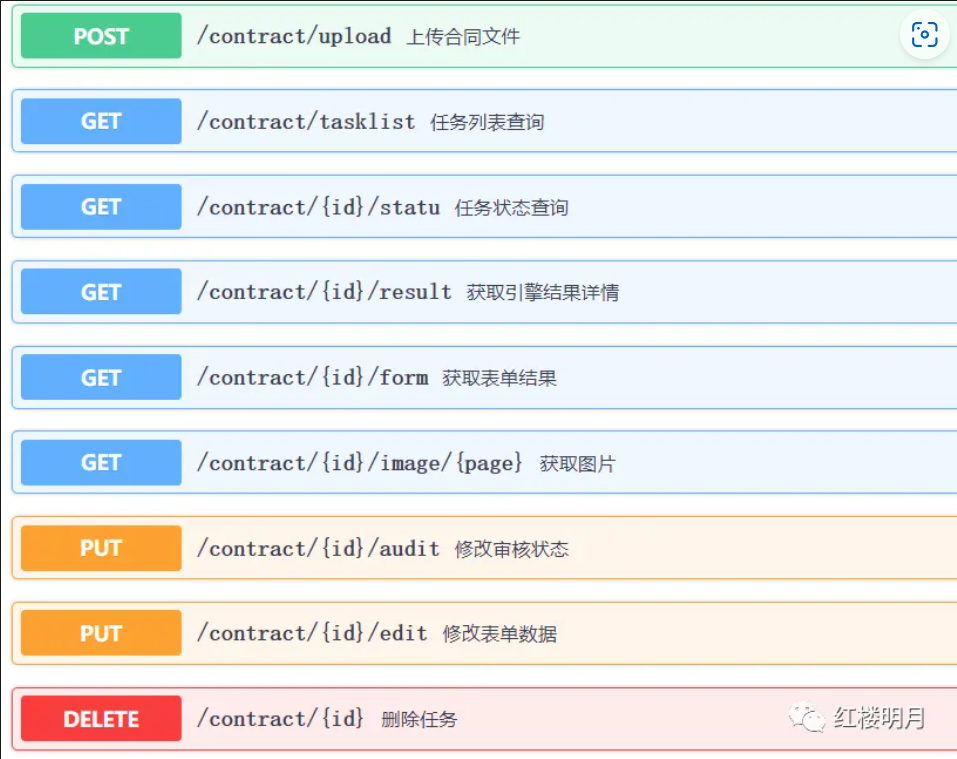
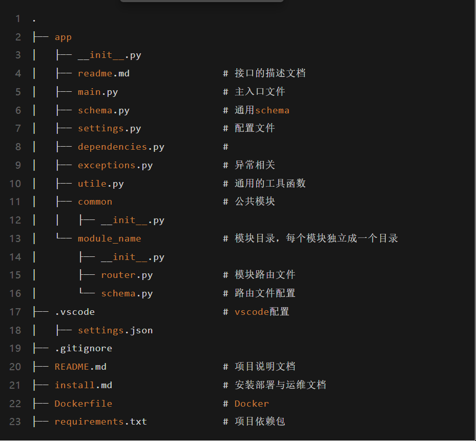

参照一些文章去优化了一版我们自己的fastapi项目设计规范


# 1 接口设计

接口设计的最高原则是尽量保持幂等性

简单来说，我们在设计接口的时候会出现各种问题，我们不可能杜绝接口出现问题，但应该在出现问题之后的测试中能够继续测试执行，直到成功。

比如例如注册用户，如果每次提交都往数据库插入记录，那就乱套了，而是插入前应该判断数据是否已经存在了，如果存在就不插入，维持幂等性。自己的一个例子在设计的时候，用了卡密就会更改卡密状态为不可用，在测试时候需要多次测试，为了效率提高，就先不做卡密状态更改，跑通兑换之后再做。

几个原则

- 接口统一使用 UTF8 编码；
- 接口的输入输出统一使用 JSON 的格式，除非特别说明；
- 图像统一使用 Base64 编码进行传输
- 函数名统一使用下划线连接，类名则统一使用驼峰命名；
- 接口和实现分离，接口只干接口的事情，就是定义输入输出，还有参数类型转换等，具体功能调用实现的函数进行实现;
- 接口应该要有基础说明，包括标题，版本号，描述信息等，如下


一个接口往往有几部分组成

（1）发起请求——HTTP动词  GET，POST，DELETE，PUT

（2）发起请求——HTTP路由

（3）收到请求——返回规范，状态码和message，data

## 1.1 请求部分

### 1.1.1 HTTP动词

http的动词有好几个，常用的几个

- GET：**获取查询数据**，从服务器获得资源（单个或多个） 比如查询个人信息

- DELETE：**删除数据**，在服务器删除资源， 比如删除用户

- POST：使用场景通常有两个

- - **新建数据**，在服务器新建资源，比如用户注册等
  - **复杂查询**时，应该使用POST，而不是用GET。

- PUT：**修改数据**，在服务器修改资源


### 1.1.2 HTTP路由

路由规范  参照[【Python】基于FastAPI的Restful规范实践](https://mp.weixin.qq.com/s?__biz=MzU3NDQ3MjI3Nw==&mid=2247484909&idx=1&sn=d516e4c8e55138118c8ae6f62833b20a&scene=21#wechat_redirect)

+ 路由里不要出现大写字母

+ 路由里尽量不要出现下划线，如果确实是两个单词才能描述一个资源，那可以使用连接符（减号）

+ 路由里通常只有最后一个才可能是动词，前面的应该都是名词。如果使用http的动作词就能表示，则路由中无需动词。

  /object/action

  其中object是操作对象，是一个名词，action是一个动词

+ 如果是对单个资源的操作（比如对某个用户操作）可以将资源的id直接放到路由中，格式如 /资源名/{资源id}/{动作}

+ 路由的第一个名词作为模块的名字，在FastAPI中实现为一个子路由（模块）

例如



### 1.1.3 HTTP参数部分

+ 复杂类型 在scheme里面设计
+ 参数字段都应该定义清楚，包括**类型，取值范围，还要有相应的说明** 如下所示

```python

class PaddingArgs(BaseModel):
    left: float = Field(0.0, title='页面的左边界空白区域', ge=0, lt=0.5,
                        description='若box的right坐标小于该值与宽度的乘积，则过滤该box')
    right: float = Field(0.0, title='页面的右边界空白区域', ge=0, lt=0.5,
                         description='若box的left坐标大于页面宽度减去该值与宽度的乘积，则过滤该box')
    top: float = Field(0.0, title='页面的上边界空白区域', ge=0, lt=0.5,
                       description='若box的bottom坐标小于该值与高度的乘积，则过滤该box')
    bottom: float = Field(0.0, title='页面的下边界空白区域', ge=0, lt=0.5,
                          description='若box的top坐标大于高度减去该值与高度的乘积，则过滤该box')
```

+ 如果是单一对象，则可以命名为Item类（类名以Item结尾），如果不太单一的，则可以命名为Resp类（类名以Resp结尾）。


## 1.2 返回部分

### 1.2.1 HTTP状态码

HTTP状态码是服务器在响应客户端请求时返回的三位数字代码，用于表示请求的处理结果。它们分为五类：

1xx：信息响应

- 100 Continue：服务器已收到请求头，客户端应继续发送请求体。举例：客户端发送一个大文件时，先发送请求头询问服务器是否接受。服务器返回`100 Continue`，表示可以继续发送文件内容。

 2xx：成功

- 200 OK：请求成功。

 4xx：客户端错误

- 400 Bad Request：请求无效。用户提交表单时漏填了必填字段，服务器返回`400 Bad Request`，表示请求无效
- 401 Unauthorized：请求需要认证。用户尝试访问需要登录的页面，但未提供认证信息，服务器返回`401 Unauthorized`
- 403 Forbidden：服务器拒绝请求。用户尝试访问一个没有权限的文件（例如管理员后台），服务器返回`403 Forbidden`。用户访问一个不存在的URL
- 404 Not Found：资源不存在。

 5xx：服务器错误

- 500 Internal Server Error：服务器内部错误。服务器在处理请求时发生未知错误（例如代码崩溃）
- 503 Service Unavailable：服务器暂时不可用。服务器因维护或过载暂时无法处理请求，

这些状态码帮助客户端理解请求的处理情况，便于调试和优化。


### 1.2.2 返回值

每一个输出的字段都应该定义清楚，包括类型，取值范围，还要有相应的说明；

状态码+message+data（详细信息）


# 2 项目结构


更详细的查看

[FastApi 最佳实践-中文版](https://hellowac.github.io/fastapi-best-practices-zh-cn/)

[zhanymkanov/fastapi-best-practices: FastAPI Best Practices and Conventions we used at our startup](https://github.com/zhanymkanov/fastapi-best-practices)




[【Python】基于FastAPI的Restful规范实践](https://mp.weixin.qq.com/s?__biz=MzU3NDQ3MjI3Nw==&mid=2247484909&idx=1&sn=d516e4c8e55138118c8ae6f62833b20a&scene=21#wechat_redirect)

[【Python】FastAPI脚手架：规范FastAPI后端接口项目开发-腾讯云开发者社区-腾讯云](https://cloud.tencent.com/developer/article/1894327)

[FastApi 最佳实践-中文版](https://hellowac.github.io/fastapi-best-practices-zh-cn/)

[【Python】基于FastAPI的Restful规范实践](https://mp.weixin.qq.com/s?__biz=MzU3NDQ3MjI3Nw==&mid=2247484909&idx=1&sn=d516e4c8e55138118c8ae6f62833b20a&scene=21#wechat_redirect)


用logging模块进行终端输出

用一个大的config配置类进行配置管理，学习那个项目

